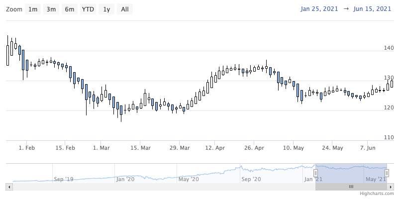
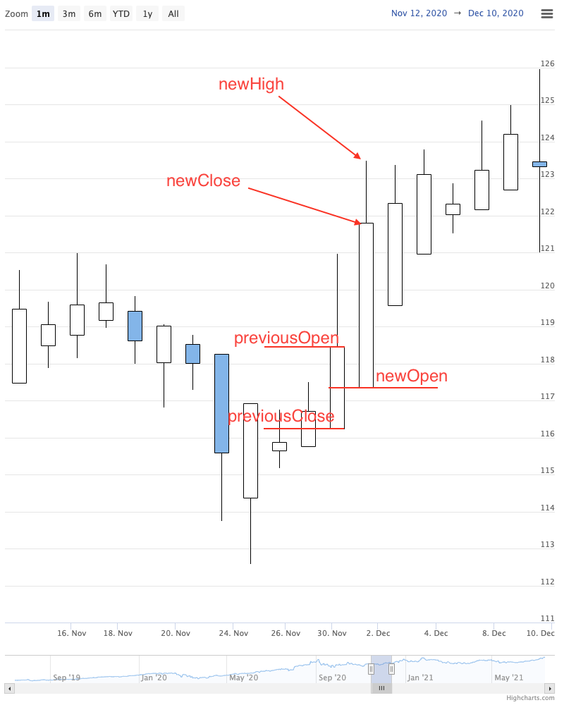

Heikin Ashi chart
================

A Heiken Ashi series is typically used to present the modified open, high, low and close price over a period of time. 
A Heiken Ashi point is composed of a body and an upper and a lower wick similarly to the candlestick. The only difference is that the open, high, low and close values have been modified by the formula.

When the data grouping is enabled, points are grouped and then the Heiken Ashi values are calculated based on grouped points.



### Calculating Heikin Ashi points

``` TS
newOpen = (previousOpen + previousClose) / 2;
newClose = (open + high + low + close) / 4;
newHigh = Math.max(high, newClose, newOpen);
newClose = Math.min(low, newClose, newOpen);
```




For more information on the Heiken Ashi chart, see the [API reference](https://api.highcharts.com/highstock/plotOptions.heikinashi).
