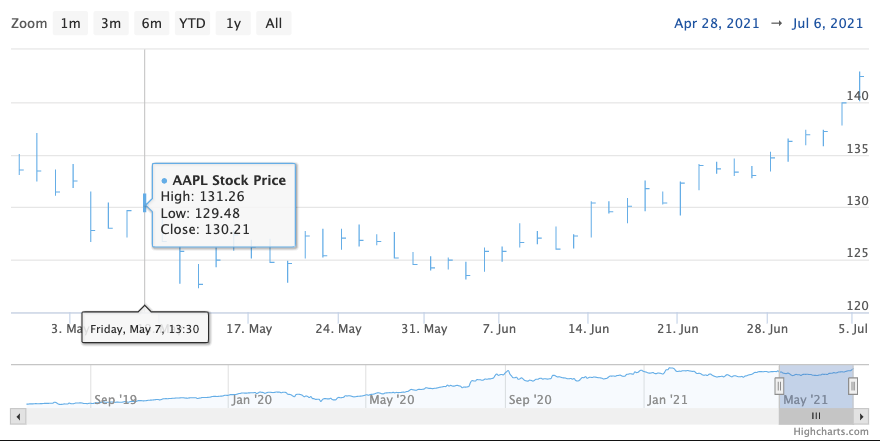

HLC chart
================

The High-Low-Close chart is typically used to show the change in price over a period of time. A vertical line shows the range of the price change where the top of the line is the highest and the bottom is the lowest. Single tickmark indicates the close value. This chart type is pretty similar to the OHLC chart, but since open value is the least significant one, you might want to omit it in chart plotting. You can use OHLC, or HLC data type to plot this chart (to use OHLC, you need to add the `useOhlcData: true` option to series config).

For more information on the HLC chart, see the [API reference](https://api.highcharts.com/highstock/plotOptions.hlc).
