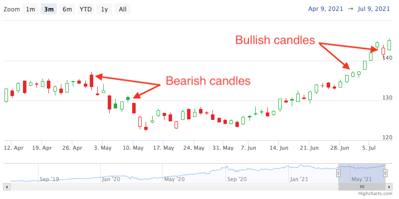

Hollow Candlestick chart
================

The hollow candlestick series is similar to the candlestick series, with a few modifications. 
The hollow candlestick point is composed of a body and an upper and a lower wick, however, it uses color and fill attributes to show price behavior. 

If the current closing price is higher than the opening price (bullish candle) the body is transparent.
When the current close is lower than the previous close, the line and filling for bearish candles has a reddish color.
Else (the close is higher than the previous close), the greenish color is applied for the line and the fill of the bearish candle.

Candles without the fill are called bullish candles and the ones with filling are bearish.

When the data grouping is enabled, points are grouped and then the candles are colored based on grouped points.

For more information on the candlestick chart, see the [API reference](https://api.highcharts.com/highstock/plotOptions.hollowcandlestick).
