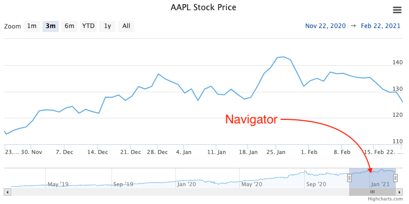

Navigator (Highstock only)
================

The navigator is a small series below the main series, displaying a view of the entire data set. It provides tools to zoom in and out on parts of the data as well as panning across the dataset.

The navigator is enabled by default for the first series in all Highstock charts. To configure which series are shown in the navigator, use the [`series.showInNavigator`](https://api.highcharts.com/highstock/plotOptions.series.showInNavigator) option.

    
    series: {
        showInNavigator: true
    }

To configure the options for the navigator series, you can set per-series options on [`series.navigatorOptions`](https://api.highcharts.com/highstock/plotOptions.series.navigatorOptions) and options for all navigator series on [`navigator.series`](https://api.highcharts.com/highstock/navigator.series).

[Live example of multiple navigator series](https://jsfiddle.net/gh/get/jquery/1.7.2/highcharts/highcharts/tree/master/samples/stock/navigator/multiple-series/)

For more information on navigator options see the [API reference](https://api.highcharts.com/highstock/navigator).
