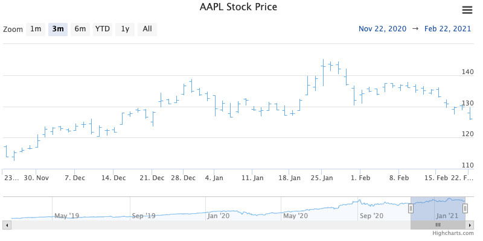

OHLC chart (Highstock only)
================

The Open-High-Low-Close chart is typically used to show the change in price over a period of time. A vertical line shows the range of the price change where the top of the line is the highest and the bottom is the lowest. A tickmark on the left side of the chart indicates the opening price and a tickmark on the rightside indicates the closing price.

For more information on the candlestick chart, see the [API reference](https://api.highcharts.com/highstock/plotOptions.ohlc).
