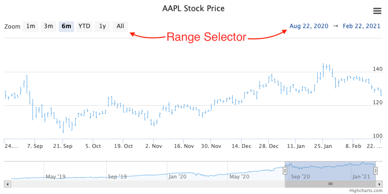

Range selector (Highstock only)
================

The range selector is a tool for selecting ranges to display within the chart. It provides buttons to select pre-configured ranges in the chart, like 1 day, 1 week, 1 month, etc. It also provides input boxes where min and max dates can be manually input.

 

Vertical position
-----------------

The range selector box can be positioned vertically.

Allowed properties are:

*   top (by default)
*   middle
*   bottom

```js
rangeSelector: {
	verticalAlign: ‘top’,
	x: 0,
	y: 0
},
```    

Use the x and y options to customise position. The x and y options offset the selector by pixels from the given alignment.


Floating
--------

The option allows to skip adding extra space for range selector. [See a live demo](https://jsfiddle.net/gh/get/library/pure/highcharts/highcharts/tree/master/samples/stock/rangeselector/floating/).

```js
rangeSelector: {
	floating: true,
	y: 250 
},
```   

 

Input position / button position
--------------------------------

The input boxes, which handle the `from` and `to` dates, can be positioned individually using the following options:

*   align (left, center, right)
*   x
*   y

For example, we can make them swap places like this:

```js
rangeSelector: {
	inputPosition: {
		align: ‘left’,
		x: 0,
		y: 0
	},
	buttonPosition: {
		align: ‘right’,
		x: 0,
		y: 0
	},
},
```


Custom button click event
-------------------------

Each range selector button can get a custom action as shown in this example:

```js
rangeSelector: {
	buttons: [{
		type: 'month',
		count: 1,
		text: '1m',
		events: {
			click: function() {
				alert(‘Clicked button’);
			}
		}
	}, {
		type: 'month',
		count: 3,
		text: '3m'
	}, {
		type: 'month',
		count: 6,
		text: '6m'
	}, {
		type: 'ytd',
		text: 'YTD'
	}, {
		type: 'year',
		count: 1,
		text: '1y'
	}, {
		type: 'all',
		text: 'All'
	}]
},
```

See the [API reference](https://api.highcharts.com/highstock/rangeSelector) for the rangeSelector option for more information on how to set up the range selector tool.
