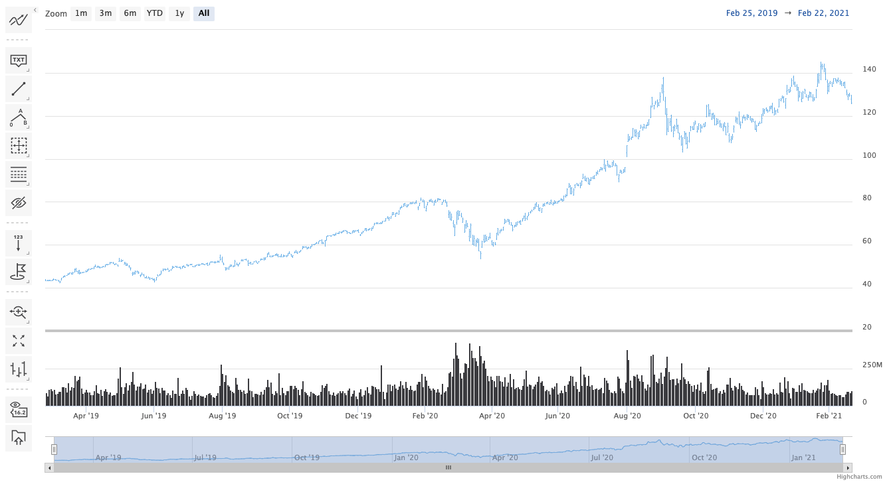

Stock tools
===

Stock Tools is a Highcharts Stock module for building a GUI that enables user interaction with the chart, such as adding annotations, technical indicators or just for zooming in or out. The module is released with Highcharts Stock 7 and won't work with previous versions.

Building the GUI is facilitated by the Stock Tools module, where your HTML elements for user interaction are automatically bound to predefined events in this module. Full list of the available bindings can be found in the API [navigation.bindings](https://api.highcharts.com/highstock/navigation.bindings).


## Quick start
To get started quickly it's recommended to use the default toolbar of the Stock Tools module. We need to load the JavaScript files in the following order.

1. First load Highcharts Stock and the bundle with all the technical indicators for convenience.
  ```html
  <script src="https://code.highcharts.com/indicators/indicators-all.js"></script>
  ```
  See the example below when you only need some specific indicators for your project. Load first the `indicator.js` base module and specific indicators successively. Technical indicators require the [indicators/indicators.js](https://code.highcharts.com/stock/indicators/indicators.js) base module. The base module includes SMA (Simple Moving Average). Find here a list of [available technical indicators](https://www.highcharts.com/docs/stock/technical-indicator-series).

  _See example below for loading specific indicators._
  ```html
  <script src="https://code.highcharts.com/indicators/indicators.js"></script>
  <script src="https://code.highcharts.com/indicators/rsi.js"></script>
  <script src="https://code.highcharts.com/indicators/ema.js"></script>
  <script src="https://code.highcharts.com/indicators/macd.js"></script>
  <script src="/ .... other technical indicators ...  "
  ```

2. Load also the other modules needed by the default toolbar: _Resizable panes, Annotations, Full screen, and Current Price_.
  ```html
  <script src="https://code.highcharts.com/modules/drag-panes.js"></script>
  <script src="https://code.highcharts.com/modules/annotations-advanced.js"></script>
  <script src="https://code.highcharts.com/modules/price-indicator.js"></script>
  <script src="https://code.highcharts.com/modules/full-screen.js"></script>
  ```
3. It is necessary to load the Stock Tools module last, so it will pick up on all available plugins above:
  ```html
  <script src="https://code.highcharts.com/modules/stock-tools.js">
  ```
4. The build-in toolbar, needs the following CSS files:
  ```html
  <link rel="stylesheet" type="text/css" href="https://code.highcharts.com/css/stocktools/gui.css">
  <link rel="stylesheet" type="text/css" href="https://code.highcharts.com/css/annotations/popup.css">
  ```
5. Now you have loaded all required files, create a stock chart as you normally would, see the below example.
  ```js
  Highcharts.stockChart('container', {
      series: [{
          type: 'ohlc',
              data: [ ... ]
          }]
      });
  ```
  And Stock Tools toolbar will show up on the left side of the chart, see the demo below.

  <iframe width="320" height="800" src="https://www.highcharts.com/samples/embed/stock/demo/stock-tools-gui" allow="fullscreen"></iframe>

  **Note:** The buttons graphics of the Stock Toolbar buttons are by default loaded from the Highcharts CDN. If you want to load Stock Tools from your local package, you might also want to set the symbol properties for each of the [`stockTools.gui.definitions`](https://api.highcharts.com/highstock/stockTools.gui.definitions). The icons are available in the Highcharts NPM [package](https://www.npmjs.com/package/highcharts) or clone the highcharts-dist [GitHub repository](https://github.com/highcharts/highcharts-dist).

  Find the icons in the `/gfx/stocktools` folder of this package.

## Build a custom UI

While the built-in Stock Tools GUI provides a comprehensive interface for adding annotations, technical indicators, and other interactions, you might want to create a fully customized user interface for your specific needs. For detailed instructions on building a custom UI, binding events to HTML elements, and creating custom dialog windows, please refer to the [Annotations GUI](https://www.highcharts.com/docs/advanced-chart-features/annotations-gui) page.