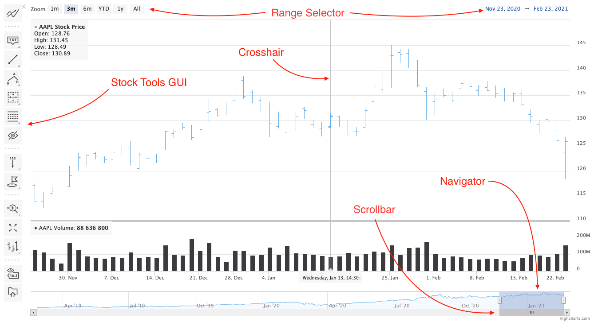

Understanding Highcharts Stock
===

Highcharts Stock is based on Highcharts, meaning it has all the core functionality of Highcharts, plus some additional features.



Highcharts Stock also supports various financial series types.

<iframe style="width: 100%; height: 540px; border: none;" src=https://www.highcharts.com/samples/embed/stock/plotoptions/series-type-interactive allow="fullscreen"></iframe>

```js
chart.series[0].update({
    type: 'candlestick'
});
```

See [Update series method](https://api.highcharts.com/class-reference/Highcharts.Series#update) and [series API options](https://api.highcharts.com/highstock/series).

Navigator and scrollbar
---------

Allows you to fine tune the range of the chart which is displayed and scroll through it.

See [Navigator](https://highcharts.com/docs/stock/navigator) for more information.

<iframe style="width: 100%; height: 610px; border: none;" src=https://www.highcharts.com/samples/embed/stock/navigator/interactive allow="fullscreen"></iframe>

```js
chart.update({
    navigator: {
        enabled: true,
        height: 100
    },
    scrollbar: {
        enabled: false
    }
});
```
To update navigator and scrollbar use [Chart update](https://api.highcharts.com/class-reference/Highcharts.Chart#update). See [navigator API options](https://api.highcharts.com/highstock/navigator).


Range selector
--------------

Allows you to quickly select a range to be shown on the chart or specify the exact interval to be shown.

<iframe style="width: 100%; height: 540px; border: none;" src=https://www.highcharts.com/samples/embed/stock/rangeselector/interactive allow="fullscreen"></iframe>

See [Range selector](https://highcharts.com/docs/stock/range-selector) for more information.

```js
chart.update({
    rangeSelector: {
        enabled: true
    }
});
```

To update range selector use [Chart update](https://api.highcharts.com/class-reference/Highcharts.Chart#update). See [range selector API options](https://api.highcharts.com/highstock/rangeSelector).

Crosshair
---------

Shows a line perpendicular to the corresponding axis which is following the mouse position or nearest point, depending on the `crosshair.snap` property. This functionality can be found in the [axis API](https://api.highcharts.com/highstock/xAxis.crosshair) options. Crosshairs can also be used in Highcharts Core (without Stock module), but are not enabled by default.

<iframe style="width: 100%; height: 570px; border: none;" src=https://www.highcharts.com/samples/embed/stock/xaxis/crosshair-interactive allow="fullscreen"></iframe>

```js
chart.xAxis[0].update({
    crosshair: {
        snap: false
    }
});
```

Crosshair is an axis property, therefore update it via [Axis update](https://api.highcharts.com/class-reference/Highcharts.Axis#update). See [axis API options](https://api.highcharts.com/highstock/xAxis.crosshair).

Data grouping
---------

Automatically groups multiple points into a single point to improve readability. The displayed value for a grouped point depends on the approximation function which is set by default depending on the series type, but can be manually overwritten. The amount of points in a single group is selected based on the zoom level, data density and user options.

<iframe style="width: 100%; height: 600px; border: none;" src=https://www.highcharts.com/samples/embed/stock/plotoptions/series-datagrouping-interactive allow="fullscreen"></iframe>

See [Data grouping](https://www.highcharts.com/docs/stock/data-grouping) for more information.

```js
chart.series[0].update({
    dataGrouping: {
        groupAll: true
    }
});
```

Data grouping is a series property, therefore update it via [Series update](https://api.highcharts.com/class-reference/Highcharts.Series#update). See [data grouping API options](https://api.highcharts.com/highstock/series.line.dataGrouping).
