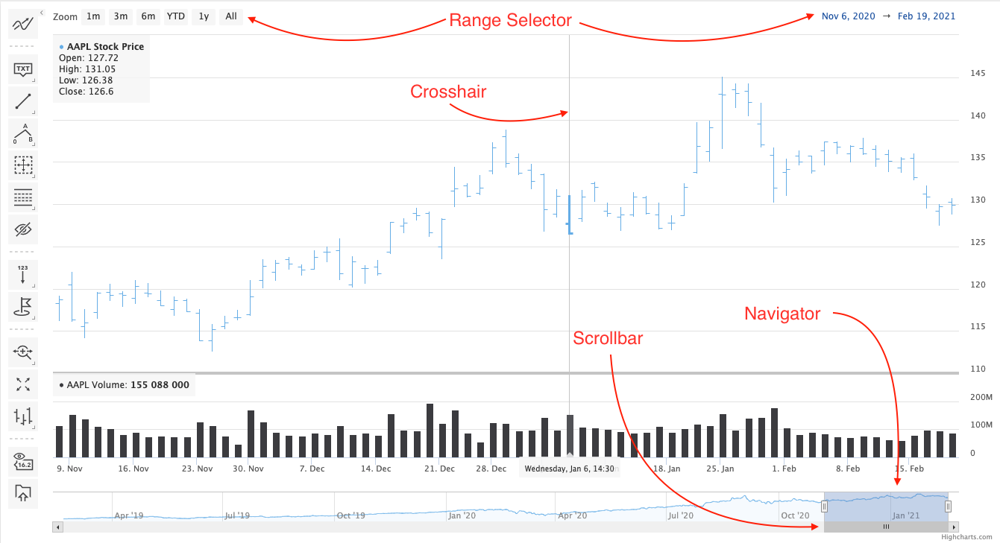

Understanding Highstock
===

Highstock is based on Highcharts, meaning it has all the core functionality of Highcharts, plus some additional features.

Highstock also supports candlestick and OHLC charts.

Navigator
---------

Allows you to fine tune the range of the chart which is displayed.

See [Navigator](https://highcharts.com/docs/chart-concepts/navigator) for more information.

Range selector
--------------

Allows you to quickly select a range to be shown on the chart or specify the exact interval to be shown.

See [Range selector](https://highcharts.com/docs/chart-concepts/range-selector) for more information.

Scrollbar
---------

Allows scrolling on the chart.

See [Scrollbar](https://highcharts.com/docs/chart-concepts/scrollbar) for more information.

Crosshair
---------

Shows a line following the tooltip of a chart to better read results of the x-axis. This functionality can be found in the [Tooltip](https://highcharts.com/docs/chart-concepts/tooltip) option. Crosshairs can also be used in Highcharts, but are not enabled by default.
